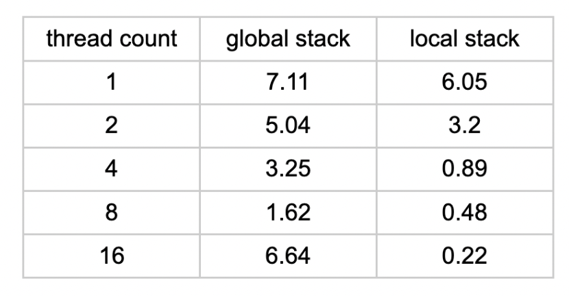

# Final Project Report
<b>Title:</b> Sudoku Solver Parallelization

<b>Code base:</b> https://github.com/thomaslee9/15-418-Sudoku-Solver

<b>Summary:</b>
We implemented a parallelized 16x16 Sudoku Solver using a local/distributed work
stack by leveraging OpenMP on the Gates Hall Cluster machines, achieving a
maximum 27.5x multithread speedup (on the medium difficulty test case) compared to
our code’s performance on one thread. Accounting for other limitations that have
caused superlinearity (using the easy difficulty test case), our code has achieved 6x
maximum multithread speedup.

<b>Background:</b>  
<i>Key data structures:</i>  
We used three main data structures for our Sudoku Solver: a cell, a board, and a
board stack. A cell data structure represents one of the cells in the sudoku board. It
consists of an integer representing its value (an integer between 1-16 if the cell is filled,
or 0 if not), and an options integer array of length 17. The 1-16th indices of the array can
be either 1, if the cell can have the value of the index, or 0, if not. (E.g. if a cell is in a
row that contains another cell that has a value of 2, then options[2] will be 0, since the
cell cannot have the value of 2 according to sudoku rules.) The 0th index of the options
array stores the total number of available values for the cell (e.g. if a cell can have
values 1 and 5, options[0] is 2.)  
A board data structure represents one entire 16x16 sudoku board. The structure
consists of a 16 by 16 2D cell array representing the cells in the board in a row-major
order (i.e. each inner 16-length cell array represents one row of the board in order.)
Finally, a board stack is simply a stack (operated on using the C++ stack library) of the
board structures. We had three board stacks in our implementation - a global stack, a
local stack for each thread, and a dummy stack for each thread for reversing.

<i>Key operations on data structures:</i>  
The board stack structure is used as a work queue – boards are pushed onto it
and then grabbed by the thread(s) executing the solver in a FIFO manner (more on this
in the Approach section). All of the operations done on any of the board stacks (push,
pop, top, and empty checks) are performed through the C++ stack library. Other than
that, we have various functions/operations that work on an individual board and the cells
within it. These include finding the first unfilled cell, filling a cell with a value and
removing that value as an option for its neighboring cells (i.e. if we fill a cell with a value
of 2, no other cells in its row, column, and box may have the value of 2, so their options
arrays must be altered) and filling in a cell that only has one possible option. We also
have various functions for debugging – printing the board, printing the options for each
cell, checking if the board is correctly solved, and checking whether an individual cell is
correctly filled considering its neighbors.

<i>Inputs and outputs:</i>  
We require that the input to our solver be a valid, solvable sudoku board (i.e. the
initial values cannot be illegally arranged.) The input is of the form of a 16-line .txt file
with 16 integers on each line corresponding to the desired input board in row-major
order. The input need not have a unique solution, though all our testing was done on
boards that do have unique solutions for ease of comparison of parallelized
performance.  
The output is a solved sudoku board, alongside the time that was taken to solve
it, and the number of threads that was used. The output is printed directly to the
terminal, and the solved board is formatted similarly to the input (16 rows with 16
integers each.)

<i>Computationally expensive parts:</i>  
The main computations performed by our solver can be broken down into two
parts: those within a single board, and those across different boards. The ones within a
board are mostly operations like filling a cell, since filling one cell also requires us to
look at and update its neighbors, reducing their options by the new cell value. However,
this is not generally computationally expensive – filling one cell requires us to update at
most 39 other cells (the 15 remaining cells in its box, plus the other 12 in the row and
column.) While this could technically benefit from parallelization, each individual update
is relatively fast, and any benefit from parallelization there will be trumped by the
overhead from spawning multiple threads.  
A much better opportunity for parallelization comes from the backtracking, which
is the main approach used by our solver. Since at first there are many cells that have
multiple valid options for their value, there are many boards that can be checked via a
backtracking approach - fill in one cell with one of its available options and continue
working on this new board until it is either solved or found to conflict, in which case
backtrack. Naturally, this spawns many boards that are independent from each other -
you can simultaneously explore the option where a given cell is filled with 2, as well as
one where it is filled with 3. This understandably results in a very large work pool of
boards, and working through all of them is quite computationally expensive. On the
other hand, this also leads to parallelization potential - as mentioned above, there are
many independent boards for multiple threads to work on at the same time.

<i>Workload and parallelism:</i>  
The total workload of the solver is the amount of different Sudoku board
permutations generated before a completed one is found by any of the threads. The
parallelism occurs when the threads pop unique potential solutions off the board stack,
attempting to make progress on them in parallel. This board stack is the main
dependency, as the threads all rely on this shared queue to receive new work from and
push their progress back, which was protected with an OpenMP lock. Since the threads
operate on their own boards independently, the execution is data-parallel and there is
plenty of locality as each thread only looks at the cells of its own board. SIMD execution
would not be applicable to this threaded implementation, as both the total workload and
thread execution sequence are non-deterministic: the randomness of the permutation
path due to the specific timings of multi-threaded push & pop would make SIMD
impossible to manage.

<b>Approach:</b>
<i>Technologies used:</i>  
The parallelism in our solver comes from OpenMP, and the code is written in
C++. We wrote and tested it on the Gates Hall Cluster machines. We have also tried
testing it on the PSC Bridges-2 machines, but that did not provide us with meaningfully
different results from the Gates machines, so all the speed and speedup data you see in
this writeup was obtained on the latter. OpenMP was initially chosen as it supports
spawning and merging vast numbers of tasks, which we believed would lend well for the
NP-complete exponentially explosive problem space of 16x16 Sudoku solutions.

<i>Algorithm/mapping:</i>  
As mentioned above, the main approach our algorithm takes to solving the
provided sudoku board is backtracking. Specifically, once any board is picked up from
the work stack, the algorithm finds the first cell whose value hasn’t been specified. If
there is no such cell, the board is solved - since we never fill a cell with a value that
cannot legally be placed in this position, once all cells are filled, we have a fully
completed board. If there is an empty cell, we check how many possible options there
are for the cell’s value. If there is only one option, that must be the value of the cell
given the current arrangement of values, so we fill it and push it back onto the work
stack. If there are multiple options, we pick the first available one, fill the cell with it, and
push both the new and the old boards onto the stack (the old one being used for
backtracking). If the cell has zero available options, a cell must’ve been filled in
incorrectly beforehand, so we pop the board off the stack and backtrack.  
All of the work described above is performed within one thread - i.e. a thread
picks up a board from the work stack and is responsible for correctly determining which
of the above options it fits into. So the mapping of the problem is such that a thread is
responsible for one board at a time, though there can be more boards than threads in
the total work pool. Since the Gates Cluster machines have 8 cores, this likely means
that one board is being processed on one core up to 8 threads, and two boards may be
processed on one core with 16 OpenMP threads (the effects of hyper-threading.)  
Additionally, we also use private local/distributed work stacks, which means each
thread is also responsible for maintaining its own local stack (i.e., there are as many
local stacks as there are threads). The way this works is that there is one global stack
which the threads may access when their local stacks are empty, but once a thread has
picked up a board and determined the next step boards in accordance with the above
rules, it pushes the necessary board(s) onto its local stack. Each local stack may
contain up to 20 boards, and if the number exceeds this, the thread pushes all the
boards in its local stack onto the global work stack (which allows other threads to “steal”
work that an individual thread would otherwise be responsible for if their stack is empty.
This helps avoid a situation where only one/a few threads are looking at viable boards
and the remaining ones are spinning aimlessly after the non-viable boards got removed
from the work pool.) This is where the dummy reverse private stacks are used - since
stacks are FIFO, and since the first board on the local work stack is the most filled in
one, we want it to be the first board on the global work stack as well.

<i>Changing original algorithm:</i>  
The functions operating on individual boards (like finding an empty cell and filling
a cell) were not changed in the transition from sequential to parallel algorithm. The main
change came from implementing the local work stacks - while the original version only
has one work stack that is accessed sequentially, the parallel version has the private
local work stacks for each thread, as discussed above. The thread only tries taking a
board from the global work stack if its local work stack is empty, reducing contention in
the threads attempting to access the board stack.

<i>Optimization iterations:</i>  
We went through various iterations of the code to arrive at its final version. For
the initial sequential version, we iterated on how we want to represent the board (trying
a 1D array and then a block-major order to improve locality, though ultimately settling on
a row-major order for both ease of understanding and performance.) We have also
added the list of valid options for each empty cell - the initial approach was to start with
every value between 1-15 as an available option, and check whether or not it is legal
only when attempting to fill the cell with it. Expectedly, this resulted in more
computations for the validity check, since we’d need to look at the 39 neighboring cells
for, at worst, all 16 options. So we created the options list and began reducing the
options of neighbors every time a cell was filled in, reducing the number of checks to
only 39 per filled-in cell. We also preprocess the input board at the start to reduce the
options of the empty cells according to the clues which were initially provided. This also
has the benefit of making sure that every time a cell is filled, it is filled with a currently
valid value without needing to check.  
For parallelization, most of the iterations of our algorithm design have included
the work stack - as one might imagine, the use of distributed/local work stacks was one
of such optimizations, as we aimed to reduce contention that occurred between threads
when there is only one global work queue for them to access. This had the intended
effect: the contention caused unpredictable results when we only had one global work
stack, with a speedup on 8 threads ranging from about 6x, to nearly 0.2x, mostly
depending on how many times the multiple threads attempted to ping the global stack
lock at each given execution. We initially attempted to implement a lock-free stack to
deal with this issue, but although we came up with a version that worked for some of our
test cases, it failed on the more difficult ones. As a result, we ended up implementing
the local work queues, which gave us much better results (see below.)  
Additionally, we tried out different cutoff sizes for the local stack to achieve the
best combination of speedup and performance, ultimately settling on 20. Larger
maximum sizes resulted in more threads not having any work to do (if the initial board
they grabbed off the global stack was infeasible, while a different thread has discovered
a feasible avenue and is filling its full local stack), and smaller sizes resulted in the
global stack lock being pinged more often as the threads attempt to offload their local
stacks into it.

<i>Existing code:</i>  
We did not start from an existing piece of code for the main sudoku solver. We
adapted the timer code and file-loading code from Assignments 3 and 4 for our
purposes.

<b>Results:</b>  
<i>Measuring performance:</i>  
We measured the performance of our algorithm via wall-clock time, as well as
speedup on multiple threads. Our main focus was optimizing speedup due to
parallelism, but we did our best to improve the actual time as well.

<i>Experimental setup:</i>  
As mentioned, all of the inputs we tested on were 16x16 “proper” sudoku boards
(i.e. boards with a unique solution.) However, we used boards of different reported
difficulties - easy, medium, and hard (with harder boards having less initial input clues,
as well as having them arranged in ways that canceled out less options for the empty
cells from the start.)

<i>Graphs: </i>  

<i>General Discussion:</i>  
	Our parallelized Sudoku solver implementation running on a single thread was just as fast as our sequential version, which did not have any OpenMP code, across all test cases. Thus, for the purposes of simplifying testing we used our parallelized implementation configured with different OpenMP thread counts: 1, 2, 4, 8, 16. The baseline is this parallelized version limited to a single core (only one thread), whereas for all other thread counts >1 we leveraged the full multi-core functionality of OpenMP. We observed the following consistent baseline single-thread execution times for the standard tests: easy: ~2 seconds, medium: ~6 seconds, hard: ~41 seconds. It is significant to note that there was some variation in total execution time when using multi-threading due to the unpredictable nature of popping pending solutions off the shared stack in parallel. Whereas the sequential version will always push and pop the same boards in the same order, the non-deterministic timing differences between threads in the parallel version leads to drastically different board permutations and solution paths.  
	The standard easy test case provided many initial clues, and so required a much lower average number of total board permutations (and thus, execution time) generated before a solution was reached (as compared to medium & hard). Increasing the thread count led to linear speedup up until 8 threads, after which the solution was only taking ~0.3 seconds to complete, at which point the total time was small enough that any efficiency gains made by   hyperthreading the 8 cores on the GHC machines to 16 threads was overshadowed by the overhead of managing them, as well as the additional lock contention. 
	Some interesting performance behavior was observed in the standard medium & hard test cases. Firstly, for the hard test case we observed that running it on 2 threads was consistently slower than on 1 thread. This was most likely due to the interaction between the immense problem space of the hard difficulty puzzle and the dual threads. Specifically, since there were only two threads the two execution contexts were in constant contention with each other, rapidly swapping the lock for the global board stack back and forth. While this was not a problem for the smaller cases, the hard difficulty exacerbated this effect, such that a single thread without these contention issues and 4+ threads with much better balancing were both faster. Finally, the medium and hard test cases exhibited superlinear speedup towards the higher thread counts: we suspected this was due to obtaining a critical mass of CPU cache memory, which enabled a secondary benefit of faster board loads from the local stack along with the thread count scaling effect.  
	The threaded version of our Sudoku solver utilizes a shared board stack, which operates as a centralized work queue for the independent threads. On any given iteration, an OpenMP thread attempts to pop a pending board solution off its local stack first, but if it is empty they pop off the shared board stack. This global board stack is thread-safe due to protected access via an OpenMP lock, and is the single primary point of contention in our implementation. Our initial parallel implementation would push to this shared stack every single time any board on any thread made progress, which caused it to be slower than the sequential version on one thread, and gain less speedup on multiple threads due to synchronization costs. Therefore, to avoid waiting on the dependency lock so frequently, we used a local stack of boards private to each thread, only pushing to the global stack once the local stack grew to a certain size and pushing them all at once. Consequently the locks were acquired much less, leading to the scalable speedup demonstrated above.

<i>Problem size:</i>  
	As seen from the graphs and the discussion above, the problem size does matter for this project. Here, we define “size” as the difficulty of the input sudoku board. Testing on hard and medium difficulties helped us expose the superlinearity potential that wasn’t apparent in the easy tests, thus hinting towards other limiting factors in our implementation (see discussion below). The hard input difficulty also demonstrated the 2-thread slowdown bump that comes from the potentially increased contention between two threads. 

<i>Limiting factors:</i>  
	Before the local stacks were introduced, we suspect that our performance was mainly limited by the synchronization costs of the global board stack. This is due to the fact that Sudoku boards are relatively small integer matrices, and the algorithm to solve them only requires quick lookup and simple calculations. Thus solving an individual board was not likely to be memory bandwidth or computationally bound. The first pass of the threaded solver, in which all threads pushed and popped directly from the global stack every iteration, proved to be slower than the sequential version, running 7 seconds for the standard medium test case as compared to 6 seconds. It also resulted in a lower speedup on multiple threads, indicating that a higher number of threads introduced greeted synchronization overhead. The time taken to solve a board on multiple threads was highly variable and depended on the number of times the stack lock was pinged - it ranged from around 3 million to around 800k, with the latter resulting in much better speedup (reported below), but this was not guaranteed and unpredictable since it was highly dependent on the order in which the threads end up popping the pending boards and executing them. The issue being a synchronization overhead was further reinforced by the fact that 16 threads gave a consistently worse performance than 8 (and sometimes even 2 and 1) threads.   
Only when reducing the contention on this global stack by implementing a local board accumulator was the proper speedup observed. The following is total execution time in seconds for the standard medium test case for the old global stack and the current local stack implementations:  

As discussed above, however, running the local stack implementation on hard and medium test cases resulted in superlinearity for large number of threads (16 on hard, and 8 & 16 for hard and medium.) This has exposed a different limiting factor that comes into play mainly because of the limiting number of resources of having less cores. Running our code with perf on these test cases, we determined that the CPU utilization is very high on less cores (utilizing all the available CPU resources when less than 8 cores are used), which suggests to us that the limiting factor may have been memory - specifically, the memory necessary to store all the possible board options on the board stack(s). This tracks with the fact that no such superlinearity was observed for the easy test case, the speedup leveling off at about 6x for 8 threads, and the CPU utilization was lower. The easy test case naturally has less possible pending boards on the board stacks since there are less empty cells to be filled, meaning the memory required for storing them all is much lower.

<i>Deeper analysis:</i>  
	Using gprof to check the time spent in the individual functions in our algorithm, it appears that the largest percentage of the time (43.7%) was spent in the function responsible for reducing the options of neighboring cells every time a cell is filled in (i.e., if a cell is filled in with value 2, none of its 39 neighbors may have 2 as a valid option.) This makes sense, as this function is inevitably called each time a cell is filled, and must perform a consistent amount of computation. The next largest amount of time (29.63%) was spent in a function finding the first available empty cell once a thread had picked up a pending board. This could’ve been improved somewhat by recording the first empty cell location within the board structure. Once a board is popped from the stack, its first empty cell can be immediately accessed, and finding the next empty cell would take less computation time, since we could start from the current empty cell location instead of from the start. 

<i>Choice of machine target: </i>  
We believe that a CPU was definitely a good choice for our purposes - multiple threads operating on a work stack have resulted in a notable speedup, as did adding additional CPU resources. However, if we were to work on this project further, we could explore GPU/CUDA/SIMD as an option for parallelization within a board, as opposed to over the work stack - for example, CUDA seems like a useful option for being able to update the valid options of neighboring cells after filling in a cell with a value, since this performs the same non-branching operation across a reasonably large number of cells. And since this was the part of our code where the most time was spent as mentioned above, this could’ve had a significant effect on the overall speed of our algorithm. 

<b>References:</b>  
https://afteracademy.com/blog/sudoku-solver/  
https://cse.buffalo.edu/faculty/miller/Courses/CSE633/Sankar-Spring-2014-CSE633.pdf  
https://1sudoku.com/sudoku-variants/super-sudoku-16x16

<b>Work list/distribution:</b>  
Setting up Code Base and creating initial Data Structures & Helper Functions:
	Thomas Lee

Sequential implementation:
	Alex Mikhalenko

Global stack implementation:
Thomas Lee

Local stack implementation:
Thomas Lee & Alex Mikhalenko found and fixed a very, very critical bug

Background/approach:
Alex Mikhalenko 

Results/analysis:
	Thomas Lee & Alex Mikhalenko

Website: 
	Alex Mikhalenko

Total credit distribution: 50/50

